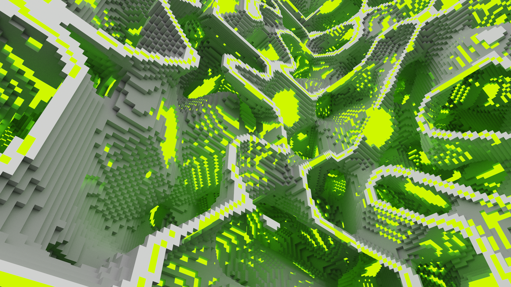
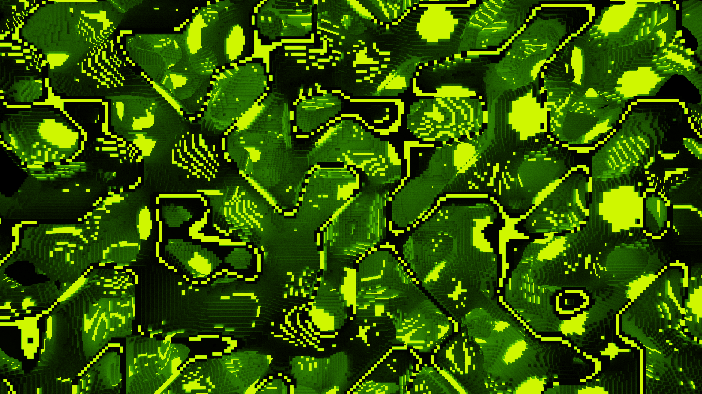

# Voxel Builder
A voxel model building program.

The Voxel Builder is a Python-based project that allows you to create beautiful 3D voxel models using procedural generation techniques. The project uses the [noise](https://pypi.org/project/noise/) and [NumPy](https://numpy.org) libraries to generate the [Perlin noise](https://en.wikipedia.org/wiki/Perlin_noise).

By algorithmically generating the content, complex models can be created with intricate details without manual design.

## Requirements
- [Python 3.10 or higher](https://www.python.org/downloads/)
- [NumPy](https://numpy.org)
- [noise](https://pypi.org/project/noise/)
- [tqdm](https://pypi.org/project/tqdm/)
- Any program to open .vox files (For example, [MagicaVoxel](https://ephtracy.github.io))

## Installation
1. Clone the repository to your local machine.
2. Install the required packages using pip install -r requirements.txt.

## Credits
Inspired by: [John Kunz](https://www.johnkunz.com/geometric-landscapes/)

The project is under [CC BY-NC-SA](https://creativecommons.org/licenses/by-nc-sa/4.0/) license

## Contacts
If you have any questions or suggestions, please feel free to contact me at goldphoenixoriginal@mail.ru
