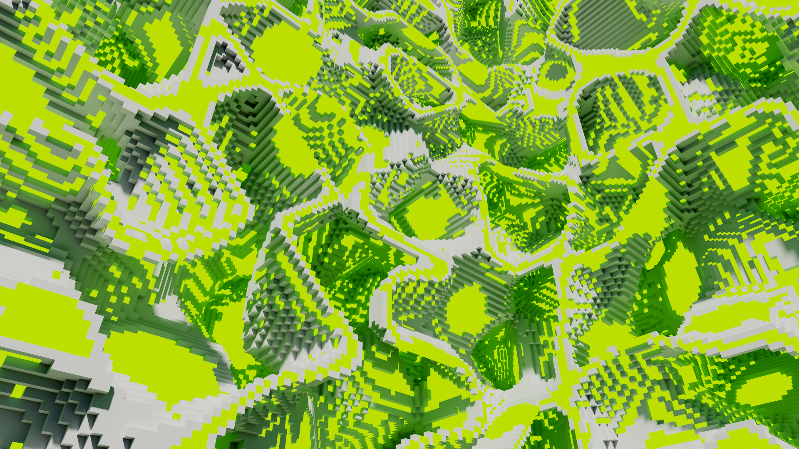
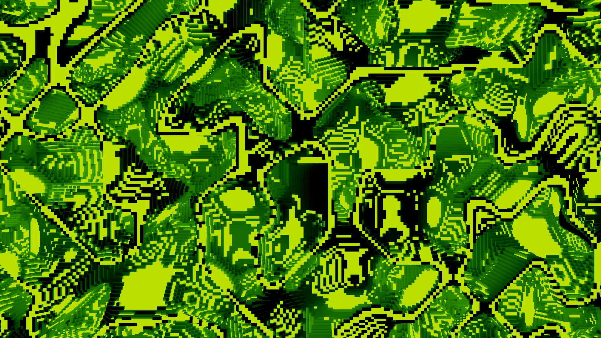

# Voxel Builder
A voxel model building program.

The Voxel Builder is a Python-based project that allows you to create beautiful 3D voxel models using procedural generation techniques. The project uses the [Noise](https://pypi.org/project/noise/) library to generate the [Perlin noise](https://en.wikipedia.org/wiki/Perlin_noise).

By algorithmically generating the content, complex models can be created with intricate details without any manual design.

*Voxels are small cubic elements that are used to create a three-dimensional grid in virtual environment. Much like a pixel represents a 2D unit of space in a digital image!

## Requirements
- [Python 3.10](https://www.python.org/downloads/) or higher
- [NumPy](https://numpy.org)
- [Noise](https://pypi.org/project/noise/)
- [TQDM](https://pypi.org/project/tqdm/)
- [Any program to open .vox files](https://ephtracy.github.io)

## Installation
1. Open a terminal or command prompt on your computer.
2. Navigate to the directory where you want to clone the repository to with  
   `cd path/to/destination/directory`.
3. Run `git clone https://github.com/Dan1la-dev/Voxel-Builder` to clone the repository.
4. Install the required packages using `pip install -r requirements.txt`.
5. Enjoy exploring endless possibilities using my humble project!  
   *Ok, this is awkward...*

## Credits
Inspired by: [John Kunz](https://www.johnkunz.com/geometric-landscapes/), [Minecraft](https://www.minecraft.net)

Voxel Builder ©2023 by [_Dan1la](https://github.com/Dan1la-dev) is licensed under [CC BY-NC-SA 4.0](https://creativecommons.org/licenses/by-nc-sa/4.0) license.

## Contributing
Contributions to the Voxel Builder project are always welcome! If you have any ideas for new features or improvements, you can always write me your suggestions.

## Contacts
Feel free to contact me at goldphoenixoriginal@mail.ru
